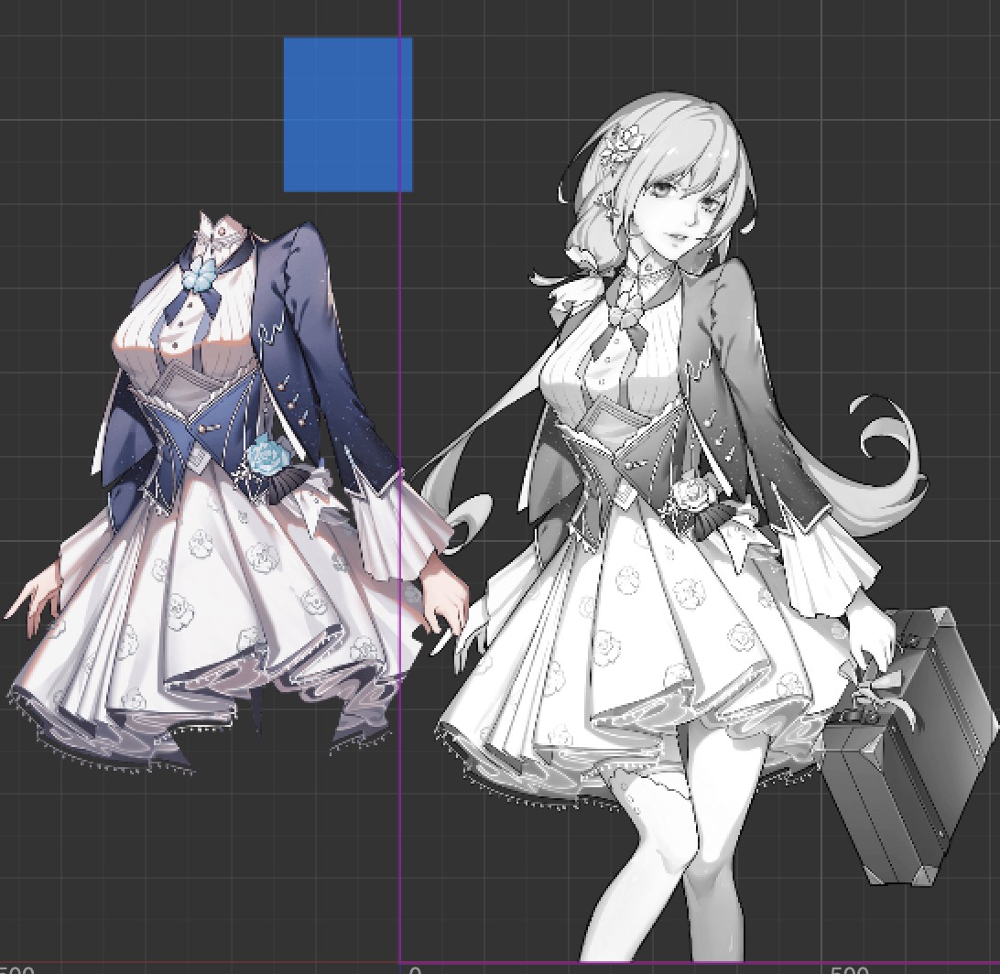
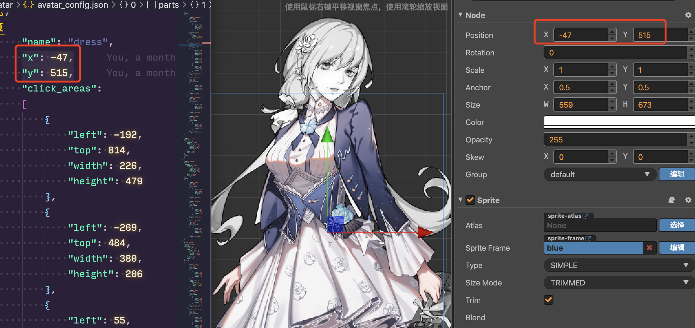
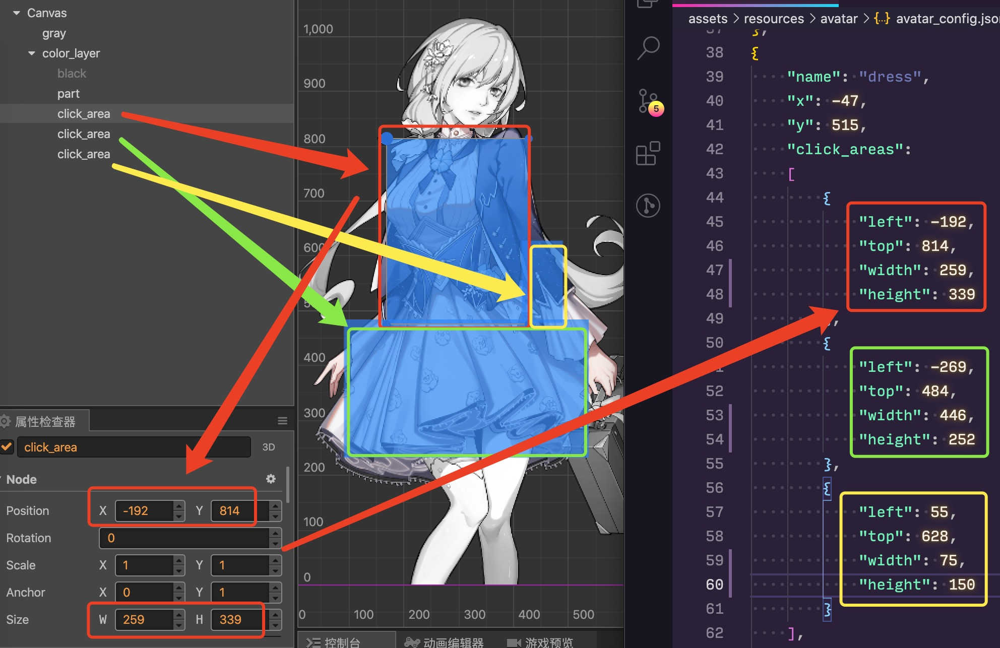

# 填色功能开发说明

---

## 一、为何是Avatar？

玩家在玩填色系统时，就是在给指定的部位贴上一层已经准备好的图，其本质是在给角色进行换装，所以在这里使用业界常用的命名——Avatar，译为[纸娃娃系统](https://baike.baidu.com/item/%E7%BA%B8%E5%A8%83%E5%A8%83%E7%B3%BB%E7%BB%9F/5151234?fr=aladdin)（详细历史由来见此超链接）。

在该系统功能的加持下，我们为此还添加了一个名为"明信片"的截图功能，玩家可以在完成角色自定义填色后，对其进行排版截图以方便分享传播。

---

## 二、资源文件夹结构说明

在resources之下，我们规定了这样的文件存放规则：

```
avatar // 根目录
├── 2 // 角色文件夹, 2对应黑白角色id, 这里对应林果果
│   ├── gray.png // 角色黑白底图
│   ├── parts // 各部位彩色切图文件夹
│   │   ├── dress // 裙子部位文件夹
│   │   │   ├── icon // 裙子部位彩色按钮图标文件夹
│   │   │   │   ├── blue.png // 蓝色按钮图标
│   │   │   │   └── ... // 其他颜色按钮图标
│   │   │   └── texture // 裙子部位彩色切图文件夹
│   │   │       ├── blue.png // 蓝色裙子切图
│   │   │       └── ... // 其他颜色裙子切图
│   │   └── ... // 其他部位文件夹
│   └── postcard // 明信片文件夹
│       ├── bg.png // 明信片背景图
│       ├── msg1.png // 明信片信息图1
│       ├── msg2.png // 明信片信息图2
│       ├── name.png // 明信片角色名图
│       └── qr_msg.png // 明信片二维码信息图
├── ... // 其他角色文件夹
├── avatar_config.json // 配置文件
├── logo.png // logo图
├── null.png // 取消填色按钮图标
└── qr.png // 二维码图
```

---

## 三、配置文件结构说明

avatar_config.json为配置文件，其内容定义为这样的结构体的列表（见AvatarViewImpl.ts脚本中的AvatarShowType）：

```ts
// 展示类型, 与avatar_config.json同结构
type AvatarShowType = {
    name: string, // 名称
    id: number, // id
    postcard: { // 截图明信片设置
        enabled: boolean, // 是否有明信片
        role: {
            scale_x: number, // 角色x缩放系数
            scale_y: number, // 角色y缩放系数
            offset_x: number, // 角色x坐标偏移值
            offset_y: number // 角色y坐标偏移值
        },
        msg1_x: number, // 明信片信息图1的x坐标偏移值
        msg2_x: number // 明信片信息图2的x坐标偏移值
    }
    parts: Array<{ // 部位结构体
        name: string, // 部位名称
        x: number, // 部位坐标x
        y: number, // 部位坐标y
        click_areas: Array<{ // 有效触碰区域范围
            left: number,
            top: number,
            width: number,
            height: number
        }>,
        types: Array<string>, // 包含颜色类型
        shop: { // 商品属性, 该属性不一定存在
            type: string, // 商品类型
            title: string, // 商品标题
            msg: string // 商品描述
        }
    }>,
    coming_soon: boolean // 是否为敬请期待
};
```

例如：

```json
[
    {
        "name": "林果果",
        "id": 2,
        "postcard": {
            "enabled": true,
            "role": {
                "scale_x": 1.1,
                "scale_y": 1.1,
                "offset_x": 30,
                "offset_y": 0
            },
            "msg1_x": 87,
            "msg2_x": 0
        },
        "parts":
        [
            {
                "name": "necklace",
                "x": -65,
                "y": 817,
                "click_areas":
                [
                    {
                        "left": -130,
                        "top": 870,
                        "width": 115,
                        "height": 101
                    }
                ],
                "types": ["1"], // 这里用1是因为策划不知道用什么颜色来形容
                "shop": {
                    "type": "1",
                    "title": "锁骨链",
                    "msg": "把我的心放进打印机，是不是就可以变成两颗心？一颗爱人，一颗爱己。"
                }
            },
            {
                "name": "dress",
                "x": -47,
                "y": 515,
                "click_areas":
                [
                    {
                        "left": -192,
                        "top": 814,
                        "width": 226,
                        "height": 479
                    },
                    {
                        "left": -269,
                        "top": 484,
                        "width": 380,
                        "height": 206
                    },
                    {
                        "left": 55,
                        "top": 628,
                        "width": 81,
                        "height": 192
                    }
                ],
                "types": ["blue", "dustyblue", "green", "red"]
            },
            {
                ... // 其他省略
            }
        ]
    },
    {
        ... // 其他省略
    }
]
```

**值得注意的是，这里为了做图层区分，在配置文件的parts列表中越靠前的，其图层越高，越能覆盖其他图层。在程序中，由于是动态加载的资源，因此该效果是通过修改zIndex来完成的。**

---

## 四、配置场景使用说明

打开配置场景avatar_test.fire，可以看到这样的结构：

```
Canvas // 根节点
└── gray // 角色黑白底图
    └── color_layer // 彩色切图层
        ├── black // 黑色遮罩
        ├── part // 彩色切图
        └── click_area // 点击区域
```

使用方法步骤如下：

### 1. 替换

gray替换为目标角色黑白底图，part替换为目标彩色切图



### 2. 对准

彩色切图坐标对准黑白底图，记录此时part的坐标到配置文件中的部位坐标x和部位坐标y



### 3. 框选

框选合适的有效点击区域（可以存在多个），记录此时的click_area的值到配置文件中的有效触碰区域范围列表



**以上步骤对每个部位的其中一个完成配置即可，因为目前各部位的切图只是颜色不同而大小是相同的。**

---

## 五、预制体结构说明

打开AvatarView.prefab预制体，可以看到这样的结构（由于里面内容较多，在这里不一一展开）：

```
AvatarView // 根节点
├── bg // 挂载事件拦截脚本的背景层
├── title // 标题，里面的内容在这里我们不关心
├── role_layer // ⭐️ 角色层，需要重点关注
├── left_btn // 左按钮
├── right_btn // 右按钮
├── screen_shot_btn // 截图按钮
├── guide_layer // ⭐️ 新手引导层，需要重点关注
├── shop_layer // ⭐️ 商品层，需要重点关注
├── tips_layer // ⭐️ 提示层，需要重点关注
└── touch_effect_layer // 触碰效果层
```

下面对需要重点关注的节点层级进行逐个说明。

### 1. 角色层

```
role_layer // 根节点
├── bg // 一张白色背景
├── scale_layer // 角色缩放层，为了方便做屏幕适配而存在
│   ├── gray_role_bg // 黑白角色底图，注释较长见[1]
│   └── color_role_parts_layer // 彩色贴图层，注释较长见[2]
├── loading // 加载中遮罩，处于资源加载中时会覆盖住画面（这里内容不展开）
├── progress_bar // 进度条，处于资源加载中时会显示（这里内容不展开）
├── shop_tips // 商品部位激活时会显示，以提示玩家跳转至商城（这里内容不展开）
└── coming_soon // 配置表中设置了敬请期待的角色，会显示此节点（这里内容不展开）
```

[1] gray_role_bg黑白角色底图挂载了PortraitFixComponent，缩放目标是scale_layer，缩放参考窗口大小为role_layer
[2] color_role_parts_layer彩色贴图层，玩家选择的动态加载的彩色部位图将会以此节点为根节点，并以配置文件设定的zIndex排序

### 2. 新手引导层

```
guide_layer // 根节点
├── block // 挂载事件拦截脚本的纯黑色透明背景层
└── role_layer // 具体见注释[3]
```

[3] 此处为了达成新手引导高亮效果，对role_layer进行了一个模仿，摘除了部分无用节点：bg、shop_tips、coming_soon

### 3. 商品层

```
shop_layer
├── block // 挂载事件拦截脚本的纯黑色透明背景层
└── role_layer // 具体见注释[4]
```

[4] 此处为了达成商品部位高亮效果，仅仅保留color_role_parts_layer，动态加载的彩色部位图以此节点为根节点后，将会替换一个外发光shader材质

### 4. 提示层

层级内容不需要关心，当需要提示时，将会把该节点移动至目标节点之下以完成坐标定位

---

## 六、脚本说明

### 1. 存档

见AvatarViewImpl.ts脚本，存档类型为AvatarSaveType的列表：

```ts
// 存档类型
export type AvatarSaveType = {
    id: number, // 角色id
    parts: Array<{ // 需要保存的部位
        name: string, // 部位名称
        type: string // 存储的当前部位类型
    }>,
    shop_block_layer_state: AvatarShopBlockLayerState, // 商品阻断层状态
    new_hide: boolean // 是否隐藏new标记
};
```

其中商品阻断层状态类型为：

```ts
// 商品阻断层状态
enum AvatarShopBlockLayerState {
    NOT_ACTIVATED, // 未被激活，点击商品部位无法打开商品信息栏
    ACTIVATED, // 已激活, 此时可点击阻断层关闭, 或点击商品关闭阻断层并打开商品信息栏
    INVALID // 失效, 此时可点击商品部位并打开商品信息栏
}
```

填色结果存档存在``GameRecord.globalVariables["paint"]``中，填色新手引导是否完成存在``GameRecord.globalVariables["paint_guide_complete"]``中

### 2. 屏幕适配

调整适配问题时，以 1280 \* 720 为标准进行适当调整，记得需要同时调整的节点有3个role_layer

### 3. 实例化一堆按钮

btns实例化时，需要设置跳转至剧情界面时的回调``onClickGoToPlotViewCallback: Function``，具体见代码注释，此处不展开讲解

### 4. 新手引导

新手引导使用``guide(setStep: number)``方法执行，新手引导的流程是固定用女主林果果来说明的，代码是写死的，其流程如下：

0. 点击头发（完成加载资源后）

1. 选择颜色

2. 换颜色

3. 点击衣服

4. 选择颜色

5. 换颜色

6. 关闭新手引导

完成新手引导后，将会设置``GameRecord.globalVariables["paint_guide_complete"]``为``true``

### 5. 触碰部位检测

```ts
// 触碰结果类型
type AvatarTouchResultType = {
    name: string, // 触碰部位
    x: number, // 坐标x
    y: number, // 坐标y
    types: Array<string> // 触碰部位包含的多种类型
} | undefined;

// 遍历每个点击范围区, 以检测点击坐标是否在某个部位的点击范围内
touchPartAreaTest(x: number, y: number): AvatarTouchResultType { /*...*/ }
```

在原本策划案还没有确定加入商品部位时，是单纯遍历每个点击范围区, 以检测点击坐标是否在某个部位的点击范围内的。

而后来加入了商品部位后，需要先检测商品部位是否处于可以触碰的状态，再做分支去进行触碰检测。因此代码会看上去比较复杂。

触碰检测的原理实际上是简单的矩形检测，表现在这一行：

```ts
if ((c.left < x) && (x < (c.left + c.width)) && (c.top > y) && (y > (c.top - c.height))) { /*...*/ }
```

**现在可以获取到触碰部位数据了， 在有了这个基石后，就可以很方便地进行后续资源加载，替换贴图实现填色效果了。**

### 6. 生成按钮进行填色

在``onTouchCallback(event)``中，当触碰部位有效时，会动态加载出不同颜色的填色按钮``AvatarBottomSelectBtn``并进行初始化。当点击这些填色按钮时，会调用父级的``onChangeType(typeName: string, save: boolean = true)``方法进行替换指定部位颜色。

### 7. 明信片（截图）

检测是所有非商品部位填色完成后，即可传参入``PostcardViewPresenter``，详见``screenShot()``方法。

**不过需要注意的是，最终调用的微信截图接口并不是太好用（见``CCWechatScreenShotMgr``），有些机型截图时有一定概率会失败，且微信版本较低时也无法截图，因此添加了一些回调方法以提示玩家。**

---

## 七、其他

若还有问题，可联系微信13676052456，Numbfish