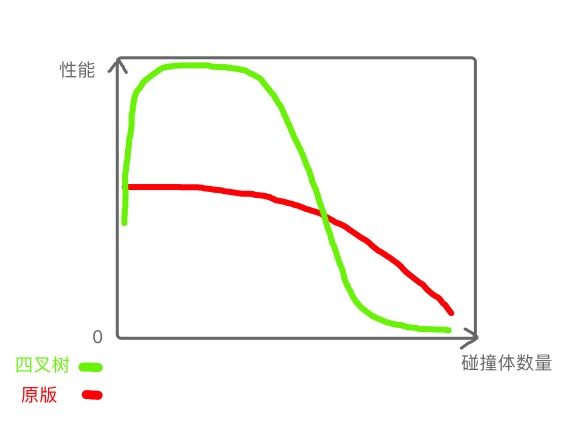

# 相比knife-io的对性能进行优化的操作说明

---

## 一、引擎升级

### 1. 卡顿的来源之一：draw call

原版飞刀项目使用的引擎为cocos creator v2.1.0（冰狮特别版），该版本在20200917版本的性能表现处于在可接受范围内（可见项目归档http://wiki.icesimba.com/pages/viewpage.action?pageId=1343888）。

当时**一局产生的飞刀总数量是较少的，每个飞刀都是一个碰撞体，游戏规则是飞刀戳到角色时，角色立即死亡**。在尺寸大小方面，飞刀大小与角色大小相比，飞刀会明显较大一些。因此以这个规则来说是合适的。

但后面对游戏内容进行升级魔改，变为**“飞刀西游版”**（该项目后来又被魔改为了“我脸贼大”）后，draw call被拉得很高，且配置的飞刀总数量也提高了，导致了游戏明显卡顿。

在清楚了游戏卡顿的原因后（draw call较大），我们对游戏引擎进行了版本升级，升至了v2.4.3。该版本有提供自动合图功能，升级后性能优化效果显著，draw call也降低了非常多。

### 2. 总结

| 游戏版本 | 引擎版本                           | draw call值 | 一局飞刀总数量 | 飞刀尺寸 | 性能 |
| -------------- | ---------------------------------- | --------- |--| -- | -------------- |
| 原版飞刀       | cocos creator v2.1.0（冰狮特别版） | 中 | 中 | 长 | 中 |
| 原版飞刀西游版 | cocos creator v2.1.0（冰狮特别版） | 大 | 多 | 长 | 差 |
| 飞刀西游版引擎升级 | cocos creator v2.4.3               | 中 | 多 | 长 | 中 |

## 二、合并碰撞体

### 1. “飞刀西游版”的终结

在一次测试配置表时，不小心把刀的大小设置得太小了，导致出现了一个很funny的画面。以此为契机，我们又对游戏进行了魔改，变成了**“我脸贼大”**，飞刀西游版也就此终结了。

### 2. 失败的尝试：四叉树

由于此时刀变得很小，在一次开会中，为了进一步优化性能，确定了一个优化方向：使用**四叉树**进行裁剪碰撞检测数量。但后面实际测试后发现效果并不好，甚至某些情况下会导致**“负优化”**。出现这种情况的原因是，以目前的游戏规则：“每个飞刀都是一个碰撞体，游戏规则是飞刀戳到角色时，角色立即死亡”，每一把飞刀都需额外存储四叉树数据，作为主动方去进行碰撞检测。如果刀数量较少时，其性能高于原版碰撞引擎；如果刀数量适中时，其性能与原版碰撞引擎持平；如果刀数量较多时，其性能就不及原版碰撞引擎了。



当时测试得到四叉树版本的性能拐点对应的碰撞体数量太少，因此放弃了这个方案。

### 3. 新的尝试：修改游戏规则

又在一次开会中，决定了将吃到的刀的碰撞体**“合并”**到角色的圆形碰撞体内。具体操作为，放弃让刀成为主动方去进行碰撞检测，即取消刀的``onCollisionEnter``回调。主动方为Player，主要回调内容都合并到Player.js中的``onCollisionEnter``执行。进行了这样的操作后，性能如预想中的一样得到了不错的提升。

### 4. 总结

在完成规则修改后，还对该项目进行了draw call的优化等，各版本比较见下表：

| 游戏版本           | 引擎版本                           | draw call值 | 一局飞刀总数量 | 飞刀尺寸 | 性能 |
| ------------------ | ---------------------------------- | ----------- | -------------- | -------- | ---- |
| 原版飞刀           | cocos creator v2.1.0（冰狮特别版） | 中          | 中             | 长       | 中   |
| 原版飞刀西游版     | cocos creator v2.1.0（冰狮特别版） | 大          | 多             | 长       | 差   |
| 飞刀西游版引擎升级 | cocos creator v2.4.3               | 中          | 多             | 长       | 中   |
| 我脸贼大           | cocos creator v2.4.3               | 小          | 多+            | 短       | 好   |

## 三、其他细节

### 1. 避免开根号

在update中进行开根号是一个消耗性能的操作，如非必须开根号，建议使用Utils.js中的SquareOfDistance方法：

```js
// 返璞归真，放弃使用pow和sqrt，以快速计算距离，注意其返回值为距离的平方 -- zeqi.luo 2020.11.12
Utils.SquareOfDistance = function (v1, v2) {
    return (v1.x - v2.x) * (v1.x - v2.x) + (v1.y - v2.y) * (v1.y - v2.y);
}
```

### 2. 节点池

由于飞刀数量较多，为了不频繁创建销毁，方便资源重复利用，这里给了一个节点池管理器GameCCNodePool于GameCCNodePool.ts中

### 3. 资源预加载

见``preload``方法

---

若还有问题，可联系微信13676052456，Numbfish
